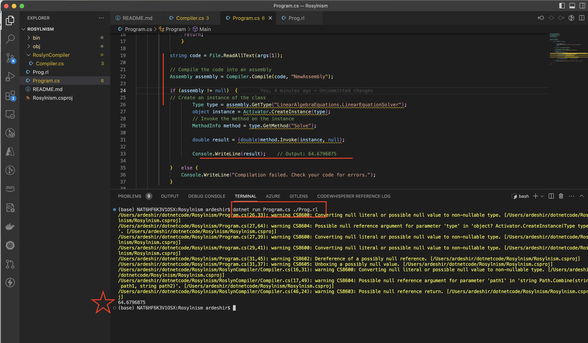

###  Roslyn Compiler API to read in a (C#) .rl file, compile it into a DLL and load its types to use in another assembly:

```csharp
using System;
using System.IO;
using Microsoft.CodeAnalysis;
using Microsoft.CodeAnalysis.CSharp;
using Microsoft.CodeAnalysis.Emit;
using System.Reflection;

namespace RoslynCompiler {

public class Compiler
{
    public static Assembly Compile(string sourceCode, string assemblyName)
    {
        SyntaxTree syntaxTree = CSharpSyntaxTree.ParseText(sourceCode);

        string assemblyPath = Path.GetDirectoryName(Assembly.GetExecutingAssembly().Location);  
        string systemRuntimePath = Path.Combine(assemblyPath, "System.Runtime.dll");  
        string systemCorePath = Path.Combine(assemblyPath, "System.Core.dll");  
  
        MetadataReference[] references = new MetadataReference[]  
        {  
            MetadataReference.CreateFromFile(systemRuntimePath),  
            MetadataReference.CreateFromFile(systemCorePath),  
            MetadataReference.CreateFromFile(typeof(object).Assembly.Location),  
            MetadataReference.CreateFromFile(typeof(Enumerable).Assembly.Location),  
        };  


        CSharpCompilation compilation = CSharpCompilation.Create(assemblyName)
            .WithOptions(new CSharpCompilationOptions(OutputKind.DynamicallyLinkedLibrary))
            .AddReferences(references)
            .AddSyntaxTrees(syntaxTree);

        using (MemoryStream ms = new MemoryStream())
        {
            EmitResult result = compilation.Emit(ms);

            if (!result.Success)
            {
                foreach (Diagnostic error in result.Diagnostics)
                {
                    Console.WriteLine($"{error.Id}: {error.GetMessage()}");
                }

                return null;
            }

            ms.Seek(0, SeekOrigin.Begin);
            Assembly assembly = Assembly.Load(ms.ToArray());
            return assembly;
        }
    }
}
}
```
## To add Microsoft Roslyn compiler package to your project, you may use the following `dotnet add package` statements:
- If you want to add the packages to a .NET Core run:

```
dotnet add package Microsoft.CodeAnalysis
dotnet add package Microsoft.CodeAnalysis.CSharp
```



# Prog.rl file

```csharp
using System;  
  
namespace LinearAlgebraEquations  {  

    public class LinearEquationSolver {  

    public static double SolveEquation(params object[] equation)  {  

                double result = Convert.ToDouble(equation[0]);  
                char currentOperator = '+';  
  
            for (int i = 1; i < equation.Length; i++)  
            {  
                var current = equation[i];  
  
                if (current is char op)  
                {  
                    currentOperator = op;  
                }  
                else if (current is Func<double, double> func)  
                {  
                    result = ApplyFunction(result, func);  
                }  
                else if (current is double operand)  
                {  
                    result = ApplyOperator(result, currentOperator, operand);  
                }  
                else  
                {  
                    throw new ArgumentException("Invalid equation element: " + current);  
                }  
            }  
  
            return result;  
        }  
  
        private static double ApplyOperator(double operand1, char op, double operand2)  
        {  
            switch (op)  
            {  
                case '+':  
                    return operand1 + operand2;  
                case '-':  
                    return operand1 - operand2;  
                case '*':  
                    return operand1 * operand2;  
                case '/':  
                    return operand1 / operand2;  
                default:  
                    throw new ArgumentException("Invalid operator: " + op);  
            }  
        }  
  
        private static double ApplyFunction(double value, Func<double, double> func)  
        {  
            return func(value);  
        }  
 
        static double DoubleValue(double x) => x * 2;  
        static double HalfValue(double x) => x / 2;  
        static double SquareValue(double x) => x * x;  
        static double CubeValue(double x) => x * x * x;  
        static double IncrementValue(double x) => x + 1;  
        static double DecrementValue(double x) => x - 1; 

       public double Solve() {  
            double result = LinearEquationSolver.SolveEquation( 
            2.0, '+', new Func<double, double>(DoubleValue),  
            3.0, '*', new Func<double, double>(HalfValue), 
            4.0, '/', DoubleValue(2.0), 
            '-', new Func<double, double>(SquareValue), 
            5.0, '+', new Func<double, double>(CubeValue), 
            6.0, '*', new Func<double, double>(IncrementValue), 
            '/', DecrementValue(7.0)
            );

            return result; 
        }  
    }  
} 
```